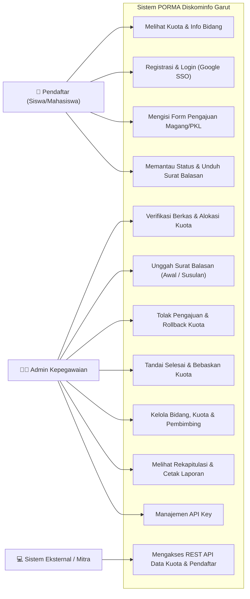
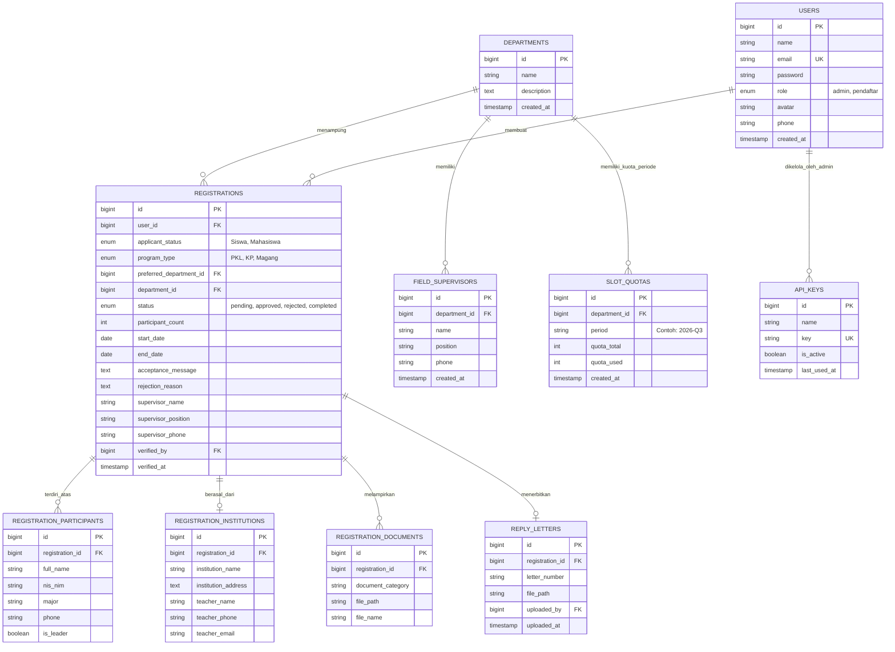
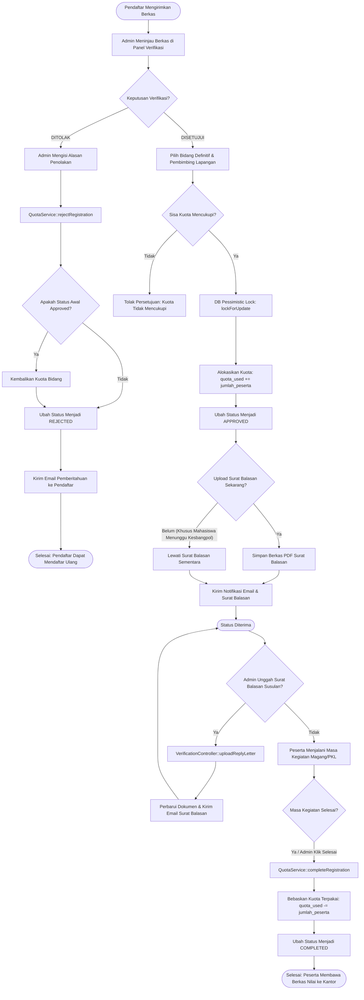

# DOKUMENTASI SYSTEM DEVELOPMENT LIFE CYCLE (SDLC)
## **PORMA — Portal Magang, Kerja Praktik & PKL Diskominfo Kabupaten Garut**
### *Sistem Manajemen Charter Slot Kuota, Verifikasi Berkas, Penempatan Peserta Digital & Integrasi REST API*

---

| Dokumen | Dokumentasi Rekayasa Perangkat Lunak (SDLC) |
|:---|:---|
| **Instansi Penyelenggara** | Dinas Komunikasi dan Informatika (Diskominfo) Kabupaten Garut |
| **Model Pengembangan** | **Iterative & Incremental SDLC (Agile Prototyping)** |
| **Teknologi Utama** | Laravel 11, PHP 8.2+, MySQL (InnoDB), TailwindCSS |
| **Versi Sistem** | v2.2 (Enterprise Academic Release) |
| **Penyusun** | Tim Kerja Praktik Diskominfo Garut |
| **Tanggal Terbit** | 21 September 2026 |

---

# DAFTAR ISI
1. [FASE 1: PLANNING (PERENCANAAN SISTEM)](#fase-1-planning-perencanaan-sistem)
2. [FASE 2: ANALYSIS (ANALISIS KEBUTUHAN SISTEM)](#fase-2-analysis-analisis-kebutuhan-sistem)
   - [2.1 Identifikasi Aktor Sistem](#21-identifikasi-aktor-sistem)
   - [2.2 Kebutuhan Fungsional (Functional Requirements)](#22-kebutuhan-fungsional-functional-requirements)
   - [2.3 Kebutuhan Non-Fungsional (Non-Functional Requirements)](#23-kebutuhan-non-fungsional-non-functional-requirements)
   - [2.4 Use Case Diagram](#24-use-case-diagram)
3. [FASE 3: DESIGN (PERANCANGAN SISTEM)](#fase-3-design-perancangan-sistem)
   - [3.1 Arsitektur Sistem (Layered Architecture)](#31-arsitektur-sistem-layered-architecture)
   - [3.2 Entity Relationship Diagram (ERD) & Struktur Database](#32-entity-relationship-diagram-erd--struktur-database)
   - [3.3 Activity Diagram & Alur Logika Bisnis](#33-activity-diagram--alur-logika-bisnis)
   - [3.4 Desain Antarmuka & Responsivitas Layar (UI/UX Guidelines)](#34-desain-antarmuka--responsivitas-layar-uiux-guidelines)
4. [FASE 4: IMPLEMENTATION (IMPLEMENTASI SISTEM)](#fase-4-implementation-implementasi-sistem)
   - [4.1 Lingkungan Pengembangan & Spesifikasi Stack](#41-lingkungan-pengembangan--spesifikasi-stack)
   - [4.2 Modul-Modul Inti Program](#42-modul-modul-inti-program)
   - [4.3 Struktur Direktori Proyek](#43-struktur-direktori-proyek)
5. [FASE 5: TESTING (PENGUJIAN SISTEM)](#fase-5-testing-pengujian-sistem)
   - [5.1 Rangkaian Pengujian Otomatis (Automated Unit & Feature Tests)](#51-rangkaian-pengujian-otomatis-automated-unit--feature-tests)
   - [5.2 Pengujian Fungsionalitas & Blackbox Testing](#52-pengujian-fungsionalitas--blackbox-testing)
6. [FASE 6: DEPLOYMENT & MAINTENANCE (PENERAPAN & PEMELIHARAAN)](#fase-6-deployment--maintenance-penerapan--pemeliharaan)
   - [6.1 Prosedur Instalasi & Penerapan](#61-prosedur-instalasi--penerapan)
   - [6.2 Penjadwalan Tugas Otomatis (Task Scheduling)](#62-penjadwalan-tugas-otomatis-task-scheduling)
   - [6.3 Manajemen Antrean Pekerjaan (Queue Worker)](#63-manajemen-antrean-pekerjaan-queue-worker)
   - [6.4 Rencana Pemeliharaan & Pemulihan (Disaster Recovery)](#64-rencana-pemeliharaan--pemulihan-disaster-recovery)

---

# FASE 1: PLANNING (PERENCANAAN SISTEM)

### 1.1 Latar Belakang Masalah
Dinas Komunikasi dan Informatika (Diskominfo) Kabupaten Garut menerima puluhan permohonan magang, Kerja Praktik (KP), dan Praktik Kerja Lapangan (PKL) setiap kuartal dari berbagai Sekolah Menengah Kejuruan (SMK) dan Perguruan Tinggi. Proses sebelumnya menghadapi kendala operasional:
1. **Ketidakpastian Kuota (*Charter Slot*):** Calon peserta tidak mengetahui apakah bidang yang diminati (Aptika, IKP, Persandian, atau Infrastruktur) masih memiliki kuota kosong sebelum mengirimkan surat pengantar resmi.
2. **Kelebihan Beban Bimbingan:** Terjadinya penumpukan peserta pada satu bidang tertentu karena belum adanya sistem kuota otomatis berjangka kuartalan.
3. **Lamanya Alur Verifikasi & Surat Balasan:** Mahasiswa dan siswa harus menunggu lama secara manual di kantor dinas untuk mengecek berkas dan mengambil surat balasan.
4. **Isolasi Data:** Data riwayat alumni magang dan ketersediaan kuota belum dapat diintegrasikan dengan aplikasi pihak luar (seperti portal satu data universitas/daerah).

### 1.2 Tujuan Pengembangan Sistem
1. Membangun portal berbasis web yang transparan dalam menyajikan data daya tampung kuota per bidang secara real-time.
2. Mengotomatisasi alokasi kuota berbasis *pessimistic locking* sehingga mencegah kebocoran slot (*race condition*).
3. Menyediakan alur verifikasi berkas daring yang dapat menerbitkan surat balasan resmi secara langsung maupun susulan (khusus pendaftar yang mengurus perizinan Bakesbangpol).
4. Menyediakan antarmuka REST API publik terproteksi API Key untuk pertukaran data magang dengan sistem eksternal.

### 1.3 Ruang Lingkup Sistem (System Scope)
* **Pengguna Publik / Pendaftar:**
  * Pemantauan sisa kuota dan informasi profil bidang Diskominfo Garut.
  * Pendaftaran akun via form lokal atau Single Sign-On (SSO) Google OAuth 2.0.
  * Pengisian formulir pendaftaran bertahap (Siswa/Mahasiswa, individu/kelompok, data pembimbing sekolah, upload PDF).
  * Pemantauan status live stepper (*Pending* $\rightarrow$ *Approved* $\rightarrow$ *Completed* / *Rejected*) dan unduh surat balasan digital.
* **Administrator Kepegawaian Diskominfo:**
  * Pengelolaan dashboard metrik, verifikasi berkas, penetapan bidang definitif, penugasan pembimbing lapangan, dan unggah surat balasan susulan.
  * Pengelolaan bidang, kapasitas kuota, dan daftar pembimbing lapangan.
  * Rekapitulasi laporan multi-kategori dan ekspor data/cetak PDF.
  * Manajemen API Key (generate, revoke, toggle) untuk akses data sistem eksternal.

---

# FASE 2: ANALYSIS (ANALISIS KEBUTUHAN SISTEM)

### 2.1 Identifikasi Aktor Sistem
1. **Calon Peserta / Pendaftar (Siswa / Mahasiswa):** Aktor yang mendaftarkan diri atau kelompoknya, melacak status pengajuan, serta mengunduh dokumen surat balasan.
2. **Administrator Kepegawaian Diskominfo:** Aktor yang memiliki wewenang administratif memvalidasi berkas, menentukan kuota, menugaskan pembimbing lapangan, dan menerbitkan surat balasan.
3. **Sistem Eksternal (API Client):** Aplikasi pihak ketiga (universitas/pemerintah daerah) yang mengonsumsi data bidang, kuota, dan rekapitulasi melalui protokol RESTful API.

### 2.2 Kebutuhan Fungsional (Functional Requirements)

| Kode ID | Deskripsi Kebutuhan Fungsional | Aktor Terlibat |
|:---|:---|:---|
| **FR-01** | Sistem dapat menampilkan kuota terpakai, kuota total, dan persentase kapasitas bidang secara real-time. | Publik / Pengguna |
| **FR-02** | Sistem menyediakan autentikasi akun melalui Google OAuth 2.0 dan registrasi lokal. | Calon Peserta |
| **FR-03** | Sistem menyediakan formulir pendaftaran bertahap yang dinamis sesuai status pendaftar (Siswa mewajibkan data guru pembimbing, Mahasiswa membuka program KP/Magang). | Calon Peserta |
| **FR-04** | Sistem mendukung pendaftaran tim multi-anggota dengan penetapan otomatis Ketua Kelompok. | Calon Peserta |
| **FR-05** | Sistem menyediakan validasi berkas unggahan PDF Surat Pengantar (maksimal 5MB) dengan penyimpanan terenkripsi. | Calon Peserta |
| **FR-06** | Sistem mencegah double-submission pendaftar jika masih memiliki berkas pengajuan berstatus aktif (*Pending* atau *Approved*). | Sistem / Pendaftar |
| **FR-07** | Sistem menampilkan pelacakan status pendaftaran (*Pending*, *Approved*, *Rejected*, *Completed*) beserta catatan alasan admin dan kontak WhatsApp pembimbing lapangan. | Pendaftar |
| **FR-08** | Sistem menyediakan panel admin terproteksi untuk meninjau berkas, menetapkan bidang penempatan, dan menugaskan pembimbing lapangan. | Administrator |
| **FR-09** | Sistem melakukan pemotongan kuota bidang otomatis secara proporsional sesuai jumlah anggota tim saat pengajuan disetujui (*Approve*). | Sistem / Administrator |
| **FR-10** | Sistem mengembalikan kuota bidang secara otomatis jika berkas yang disetujui diubah menjadi ditolak (*Reject*). | Sistem / Administrator |
| **FR-11** | Sistem membebaskan kuota bidang secara otomatis saat pengajuan ditandai selesai (*Completed*) atau tanggal selesai terlewati. | Sistem / Administrator |
| **FR-12** | Sistem menyediakan fitur unggah/ganti Surat Balasan PDF resmi secara susulan setelah pengajuan berstatus disetujui. | Administrator |
| **FR-13** | Sistem mendeteksi pembaruan data baru di latar belakang (*silent check updates*) dan menampilkan *floating notification pill* tanpa reload paksa. | Administrator |
| **FR-14** | Sistem menyediakan laporan rekapitulasi data pendaftar, program, dan bidang dengan fitur cetak/ekspor PDF. | Administrator |
| **FR-15** | Sistem menyediakan REST API (`/api/v1/departments`, `/registrations`, `/statistics`) yang terproteksi API Key. | Sistem Eksternal |
| **FR-16** | Sistem menyediakan panel manajemen API Key untuk membuat, mengaktifkan/menonaktifkan, dan menghapus kunci akses. | Administrator |

### 2.3 Kebutuhan Non-Fungsional (Non-Functional Requirements)

| Kode ID | Parameter | Spesifikasi Teknis yang Diimplementasikan |
|:---|:---|:---|
| **NFR-01** | **Integritas Konkurensi** | Menggunakan transaksi database dengan *pessimistic locking* (`lockForUpdate`) untuk mencegah alokasi kuota ganda pada waktu bersamaan (*race condition*). |
| **NFR-02** | **Keamanan Data** | Seluruh rute administratif diproteksi middleware `auth` dan `admin`. Komunikasi REST API diverifikasi via middleware `ValidateApiKey`. Input form disanitasi dari ancaman XSS, CSRF, dan SQL Injection. |
| **NFR-03** | **Responsivitas Layar** | Tampilan antarmuka fully responsive (Desktop, Tablet, Mobile) dengan adaptasi fleksibel pada kartu dokumen, tabel dengan *horizontal scroll cues*, dan menu drawer. |
| **NFR-04** | **Stabilitas UI/UX** | Bebas dari auto-reload paksa yang mengganggu kenyamanan pengguna. Menggunakan dialog modal kustom glassmorphism Diskominfo menggantikan alert bawaan browser. |
| **NFR-05** | **Reliabilitas Notifikasi** | Pengiriman email notifikasi status pendaftaran dieksekusi secara asinkron menggunakan antrean database (*Queue Worker*). |
| **NFR-06** | **Kinerja & Efisiensi** | Indeks komposit unik pada database (`department_id` + `period`) untuk memastikan pencarian kuota instan dan konsisten. |

### 2.4 Use Case Diagram



---

# FASE 3: DESIGN (PERANCANGAN SISTEM)

### 3.1 Arsitektur Sistem (Layered Architecture)
Sistem dirancang dengan pola arsitektur berlapis (*layered architecture*) yang memisahkan logika presentasi, kontrol alur, logika bisnis independen, dan lapisan basis data:

```
┌─────────────────────────────────────────────────────────────┐
│                 PRESENTATION LAYER (UI/UX)                  │
│   Blade Templates + TailwindCSS + Vanilla JS + FontAwesome  │
└──────────────────────────────┬──────────────────────────────┘
                               │ HTTP Request / Response
┌──────────────────────────────▼──────────────────────────────┐
│                  CONTROLLER & ROUTING LAYER                 │
│  VerificationController, RegistrationController, ApiController
│  Middleware: Auth, AdminMiddleware, ValidateApiKey, NoCache │
└──────────────────────────────┬──────────────────────────────┘
                               │ Delegasi Tugas Bisnis
┌──────────────────────────────▼──────────────────────────────┐
│                    SERVICE LAYER (BUSINESS)                 │
│   QuotaService (Pessimistic Locking & Quota Lifecycle)      │
│   OtpService, RegistrationStatusMail (Queueable Mailable)   │
└──────────────────────────────┬──────────────────────────────┘
                               │ Eloquent ORM Query
┌──────────────────────────────▼──────────────────────────────┐
│                      DATA ACCESS LAYER                      │
│   Models: Registration, Department, SlotQuota, ApiKey, User │
└──────────────────────────────┬──────────────────────────────┘
                               │ SQL Transactions
┌──────────────────────────────▼──────────────────────────────┐
│                  DATABASE STORAGE (MySQL)                   │
│   InnoDB Tables, Composite Unique Indexes, Foreign Keys     │
└─────────────────────────────────────────────────────────────┘
```

### 3.2 Entity Relationship Diagram (ERD) & Struktur Database



### 3.3 Activity Diagram & Alur Logika Bisnis

#### Alur Verifikasi, Alokasi Kuota, & Penerbitan Surat Balasan:


### 3.4 Desain Antarmuka & Responsivitas Layar (UI/UX Guidelines)
1. **Design Tokens Diskominfo:**
   - Biru Primer: `#014495`
   - Biru Sekunder / Aksen: `#2F90E1` & `#0B6FBB`
   - Merah Peringatan / Penolakan: `#8B0000` & `#E11D48`
   - Hijau Persetujuan: `#059669` & `#10B981`
2. **Komponen Modal Kustom Global (`#customConfirmModal`):**
   - Menggantikan dialog bawaan browser `confirm()`.
   - Menggunakan latar belakang gelap `bg-slate-950/80` dengan efek `backdrop-blur-sm` dan transisi animasi mikro `scale-95 -> scale-100`.
3. **Mobile Layout Adaptation:**
   - Kartu berkas dokumen PDF menggunakan `flex flex-col sm:flex-row` dengan penanganan nama file panjang via `break-all` dan tombol full-width di HP (`w-full sm:w-auto`).
   - Tabel panjang dilengkapi indikator visual penggeseran horizontal (*scroll cues*).

---

# FASE 4: IMPLEMENTATION (IMPLEMENTASI SISTEM)

### 4.1 Lingkungan Pengembangan & Spesifikasi Stack
* **Framework:** Laravel 11.x
* **Bahasa Pemrograman:** PHP 8.2+
* **Basis Data:** MySQL 8.0+ / MariaDB 10.4+ (Mesin Penyimpanan InnoDB)
* **Frontend:** TailwindCSS, Blade Templating Engine, Vanilla JavaScript, FontAwesome 6
* **Penyimpanan Berkas:** Driver Local Storage (`storage/app/public` terhubung via symbolic link)
* **Pengiriman Email & Antrean:** Laravel Mailable (`RegistrationStatusMail`) terhubung ke antrean database (`php artisan queue:work`)

### 4.2 Modul-Modul Inti Program

#### A. Layanan Kuota (`App\Services\QuotaService`):
Mengatur seluruh mutasi kuota agar bersifat *atomic*, konsisten, dan *thread-safe*:
```php
// Contoh implementasi pessimistic locking di QuotaService
$slotQuota = SlotQuota::where('department_id', $departmentId)
    ->where('period', self::getActivePeriod())
    ->lockForUpdate()
    ->first();

if ($slotQuota->quota_remaining < $neededSlots) {
    throw new Exception("Sisa kuota tidak mencukupi.");
}
$slotQuota->quota_used += $neededSlots;
$slotQuota->save();
```

#### B. Middleware Proteksi API Key (`App\Http\Middleware\ValidateApiKey`):
Memvalidasi otorisasi pertukaran data pihak luar:
```php
$key = $request->header('X-API-KEY') ?? $request->bearerToken() ?? $request->query('api_key');
$apiKey = ApiKey::where('key', $key)->where('is_active', true)->first();
if (!$apiKey) {
    return response()->json(['success' => false, 'message' => 'Akses ditolak.'], 401);
}
$apiKey->update(['last_used_at' => now()]);
```

#### C. Penanganan Surat Balasan Susulan (`VerificationController@uploadReplyLetter`):
Memungkinkan admin mengunggah atau mengganti surat balasan resmi secara susulan pada pendaftar yang telah disetujui.

### 4.3 Struktur Direktori Proyek
```
Project-Kerja-Praktek/
├── app/
│   ├── Console/Commands/SyncQuotaCommand.php    # Command konsol sinkronisasi kuota
│   ├── Http/
│   │   ├── Controllers/
│   │   │   ├── Admin/                          # Controller Panel Admin
│   │   │   ├── Api/PublicDataApiController.php # Controller REST API v1
│   │   │   ├── Applicant/                      # Controller Pendaftar
│   │   │   └── Auth/                           # Controller Autentikasi
│   │   └── Middleware/
│   │       ├── AdminMiddleware.php             # Proteksi Hak Akses Admin
│   │       └── ValidateApiKey.php              # Otorisasi Kunci API
│   ├── Mail/RegistrationStatusMail.php         # Email Notifikasi Status Pendaftar
│   ├── Models/                                 # Entitas Basis Data
│   └── Services/QuotaService.php               # Logika Inti Alokasi Kuota
├── database/
│   ├── migrations/                             # Skema Migrasi Basis Data
│   └── seeders/DatabaseSeeder.php              # Seeder Dummy & Akun Uji
├── resources/views/
│   ├── admin/                                  # Antarmuka Admin
│   ├── applicant/                              # Antarmuka Pendaftar
│   └── layouts/                                # Master Layout (app & admin)
├── routes/
│   ├── api.php                                 # Rute REST API v1
│   ├── console.php                             # Penjadwalan Tugas
│   └── web.php                                 # Rute Web Aplikasi
└── tests/Feature/                              # Rangkaian Automated Tests
```

---

# FASE 5: TESTING (PENGUJIAN SISTEM)

### 5.1 Rangkaian Pengujian Otomatis (Automated Unit & Feature Tests)
Pengujian otomatis dijalankan menggunakan framework PHPUnit bawaan Laravel:
```bash
php artisan test
```

#### Hasil Eksekusi Pengujian:
```text
   PASS  Tests\Unit\ExampleTest
  ✓ that true is true                                                              0.13s  

   PASS  Tests\Feature\ExampleTest
  ✓ the application returns a successful response                                  1.33s  

   PASS  Tests\Feature\QuotaServiceTest
  ✓ approve registration decrements quota                                          0.23s  
  ✓ quota exceeded throws exception                                                0.05s  
  ✓ reject approved registration restores quota                                    0.02s  
  ✓ complete approved registration releases quota                                  0.02s  
  ✓ unique composite index prevents duplicate department period                    0.06s  
  ✓ atomic lock prevents concurrent submission                                     0.17s  

   PASS  Tests\Feature\SupervisorEvaluationFeaturesTest
  ✓ registration rejects nis nim with less than 5 characters                       0.38s  
  ✓ registration accepts nis nim with 5 or more characters                         0.03s  
  ✓ applicant dashboard and detail display completion message                      0.09s  
  ✓ admin can view department quotas with stats                                    0.05s  
  ✓ admin reports filters with applicant status and date range                     0.03s  
  ✓ api endpoints reject unauthorized access                                       0.02s  
  ✓ api endpoints return data with valid api key                                   0.05s  
  ✓ admin can add multiple supervisors simultaneously                              0.02s  
  ✓ admin can check updates without hard reload                                    0.03s  

  Tests:    17 passed (79 assertions)
  Duration: 3.51s
```

### 5.2 Pengujian Fungsionalitas & Blackbox Testing

| No | Komponen / Skenario Uji | Prosedur Pengujian | Hasil yang Diharapkan | Status |
|:---:|:---|:---|:---|:---:|
| **1** | Validasi NISN/NIM Peserta | Menginput NISN/NIM kurang dari 5 karakter | Sistem menolak input dan memunculkan notifikasi validasi | **LULUS** |
| **2** | Dynamic Step Siswa vs Mahasiswa | Memilih status "Siswa" pada form pendaftaran | Program otomatis terkunci ke "PKL" dan muncul form Guru Pembimbing | **LULUS** |
| **3** | Alokasi Kuota Berkelompok | Menyetujui pendaftaran tim dengan 3 peserta | Kuota terpakai bertambah 3 slot dan sisa kuota berkurang 3 slot | **LULUS** |
| **4** | Restorasi Kuota Saat Ditolak | Menolak pengajuan yang sebelumnya sudah disetujui | Kuota terpakai dikurangi kembali secara otomatis | **LULUS** |
| **5** | Pelepasan Kuota Saat Selesai | Mengubah status pengajuan diterima menjadi SELESAI | Kuota dibebaskan dan status berubah menjadi Selesai | **LULUS** |
| **6** | Upload Surat Balasan Susulan | Mengunggah surat balasan PDF pada pengajuan approved | Surat balasan tersimpan dan terkirim ke email pendaftar | **LULUS** |
| **7** | Responsivitas Tombol "Lihat PDF" | Membuka kartu dokumen dengan nama file panjang di layar HP | Tampilan otomatis vertikal, tombol full-width, bebas dari overflow | **LULUS** |
| **8** | Modal Konfirmasi Kustom | Menekan tombol Tolak / Selesai pada verifikasi admin | Muncul modal glassmorphism Diskominfo menggantikan alert browser | **LULUS** |
| **9** | Pemantauan Tanpa Hard Reload | Mengirim pengajuan baru dari tab lain | Muncul floating notification pill di panel admin tanpa reload paksa | **LULUS** |
| **10**| Otorisasi REST API Key | Memanggil `/api/v1/departments` tanpa X-API-KEY | Mengembalikan kode HTTP 401 Unauthorized dengan respon JSON | **LULUS** |
| **11**| Konsumsi REST API Valid | Memanggil `/api/v1/departments` dengan API Key valid | Mengembalikan data status kuota seluruh bidang format JSON | **LULUS** |

---

# FASE 6: DEPLOYMENT & MAINTENANCE (PENERAPAN & PEMELIHARAAN)

### 6.1 Prosedur Instalasi & Penerapan di Server Produksi
1. **Kloning Repositori & Instalasi Dependensi:**
   ```bash
   composer install --no-dev --optimize-autoloader
   npm install && npm run build
   ```
2. **Konfigurasi Environment (`.env`):**
   * Mengatur `APP_ENV=production` dan `APP_DEBUG=false`.
   * Menetapkan konfigurasi koneksi database MySQL produksi.
   * Menetapkan `QUEUE_CONNECTION=database` untuk pemrosesan asinkron.
3. **Migrasi Database & Symbolic Link:**
   ```bash
   php artisan migrate --force
   php artisan storage:link
   ```
4. **Optimasi Cache Produksi:**
   ```bash
   php artisan config:cache
   php artisan route:cache
   php artisan view:cache
   ```

### 6.2 Penjadwalan Tugas Otomatis (Task Scheduling)
Sistem memiliki task scheduler yang didefinisikan di `routes/console.php` untuk menjalankan pelepasan kuota otomatis harian bagi peserta yang masa magangnya telah lewat:
```bash
# Perintah manual sinkronisasi kuota
php artisan porma:sync-quota
```
Di server produksi, tambahkan Cron Job Linux:
```cron
* * * * * cd /path-to-project && php artisan schedule:run >> /dev/null 2>&1
```

### 6.3 Manajemen Antrean Pekerjaan (Queue Worker)
Untuk memastikan pengiriman email notifikasi dan surat balasan ke pendaftar berjalan di latar belakang tanpa memperlambat waktu respon pengguna:
```bash
# Menjalankan worker antrean
php artisan queue:work --queue=default --tries=3 --timeout=90
```
Pada lingkungan server Linux/Ubuntu produksi, gunakan **Supervisor daemon** untuk memantau proses *queue worker* agar selalu berjalan secara otomatis jika terjadi restart.

### 6.4 Rencana Pemeliharaan & Pemulihan (Disaster Recovery)
1. **Pencadangan Basis Data (*Database Backup*):** Pencadangan database MySQL harian terjadwal via mysqldump.
2. **Pencadangan Berkas (*Storage Backup*):** Sinkronisasi direktori `storage/app/public` (berkas PDF surat pengantar dan surat balasan) secara berkala ke penyimpanan cadangan terpisah.
3. **Audit Log & Keamanan:** Pemantauan log error di `storage/logs/laravel.log` serta jejak audit waktu penggunaan API Key (`last_used_at`) untuk mendeteksi anomali lalu lintas data.

---

&copy; 2026 **Dinas Komunikasi dan Informatika Kabupaten Garut** — Dokumen Rekayasa Perangkat Lunak.
